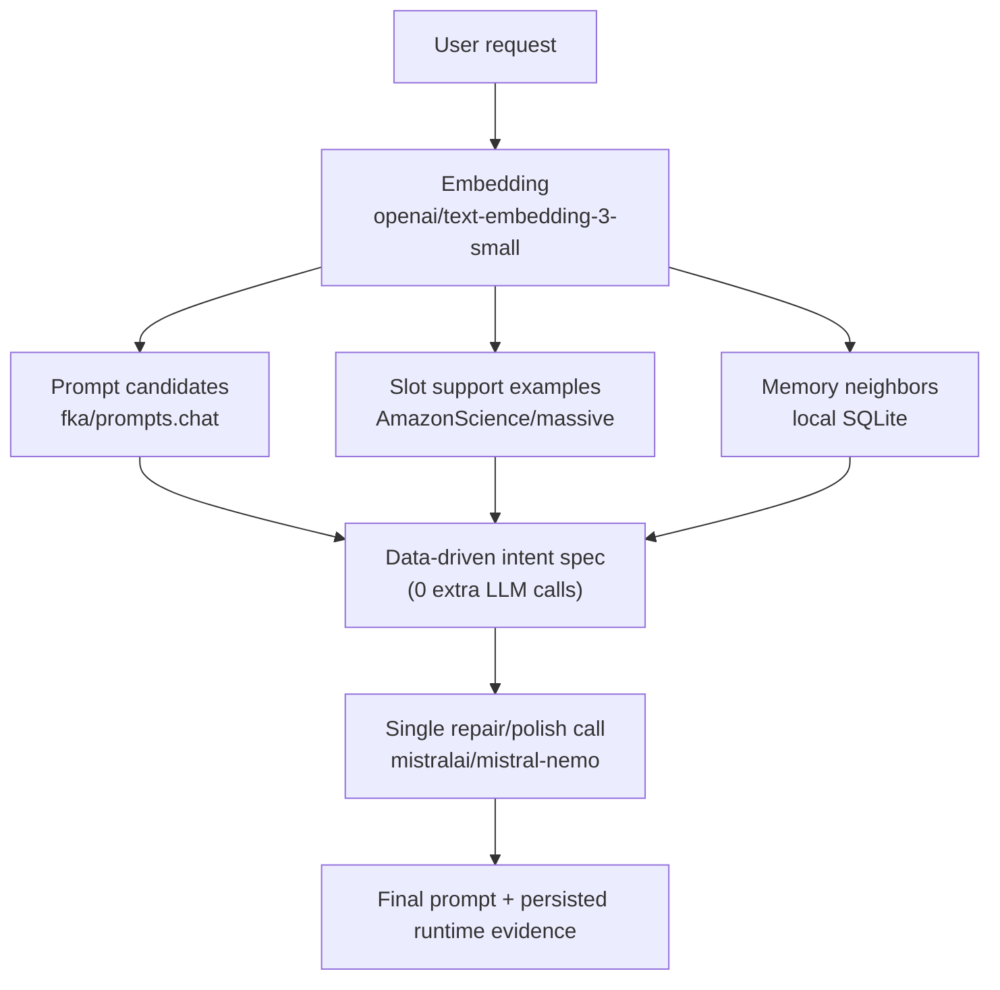

# Prompt Refinery

Retrieval-grounded prompt refinement engine as a reusable Python **library**, production CLI, and **MCP stdio endpoint**.

This project avoids hardcoded prompt templates and static keyword routing. Instead, it derives intent structure from retrieval evidence, then runs one repair/polish generation pass.

## Why this architecture

Most prompt systems break in one of two ways:

1. Overfitted template maps (fast, brittle).
2. Freeform generation (flexible, low control).

Prompt Refinery keeps both control and adaptability:

- Retrieval-first candidate selection from real corpora.
- Data-derived intent spec (objective, audience, locale evidence, slot coverage).
- Single generation call for repair + polish.
- Full runtime artifacts for inspectability (`last_result.json`, SQLite memory).

## Pipeline (research-style view)



## Installation

```bash
python3 -m venv .venv
source .venv/bin/activate
pip install -r requirements.txt
```

Create `.env` in project root:

```env
OPENROUTER_API_KEY=your_api_key_here
# Optional overrides
# LLM_API_BASE_URL=https://openrouter.ai/api/v1
# EMBED_MODEL=openai/text-embedding-3-small
# REPAIR_MODEL=mistralai/mistral-nemo
```

You can bootstrap from template:

```bash
cp .env.example .env
```

## CLI usage

After install, both commands work:

- `prompt-refinery ...` (console script)
- `python -m prompt_refinery ...` (module entrypoint)
- `./scripts/start_cli.sh ...` (repo-local launcher)

1. **Default run**
Shows prompt-only output and writes runtime artifacts.

```bash
prompt-refinery "Write a concise cold email to pitch our AI analytics tool to a logistics startup CEO."
```

2. **Explicit quality targets (CLI priority)**
`--targets` overrides profile/env/default targets.

```bash
prompt-refinery "Design a landing page prompt for B2B fintech onboarding" --targets "Fully specified output" "No unresolved placeholders" "Clear actionable wording"
```

3. **Custom standards for a domain**
Use domain-specific constraints directly from CLI.

```bash
prompt-refinery "Create a SOC2 incident response prompt" --targets "Audit-traceable steps" "Owner+deadline per action" "No ambiguous verbs"
```

4. **JSON output mode**
Prints full structured result to stdout.

```bash
prompt-refinery "Build a launch checklist prompt" --json
```

## Quality-target precedence

Priority order:

1. `--targets` CLI argument
2. `refinery_profile.json`
3. `QUALITY_TARGETS` environment variable (JSON array)
4. Built-in defaults

Default profile (`refinery_profile.json`):

```json
{
  "quality_targets": [
    "Fully specified output",
    "No unresolved placeholders",
    "Clear actionable wording"
  ]
}
```

## Library usage

```python
from pathlib import Path
from prompt_refinery import RefineryEngine, RuntimePaths, RuntimeSettings

project_dir = Path.cwd()
paths = RuntimePaths.from_project_dir(project_dir)
settings = RuntimeSettings.from_env(project_dir)

engine = RefineryEngine(settings=settings, paths=paths)
try:
    result = engine.run(
        user_text="Create a migration playbook prompt for PostgreSQL cutover",
        quality_targets=[
            "Fully specified output",
            "No unresolved placeholders",
            "Rollback steps included"
        ]
    )
    print(result["repaired_prompt"])
finally:
    engine.close()
```

## MCP endpoint (stdio)

### Start server

```bash
prompt-refinery-mcp --project-dir /absolute/path/to/prompt-refinery
```

or with startup script:

```bash
./scripts/start_mcp_stdio.sh --project-dir /absolute/path/to/prompt-refinery
```

### Example MCP client wiring (Claude Desktop / compatible hosts)

```json
{
  "mcpServers": {
    "prompt-refinery": {
      "command": "prompt-refinery-mcp",
      "args": ["--project-dir", "/absolute/path/to/prompt-refinery"]
    }
  }
}
```

### Exposed MCP tool

- `refine_prompt`

Input schema:

- `user_text` (string, required)
- `quality_targets` (string array, optional)
- `export_outputs` (bool, optional, default `true`)

### Example MCP JSON-RPC call (`tools/call`)

```json
{
  "jsonrpc": "2.0",
  "id": 7,
  "method": "tools/call",
  "params": {
    "name": "refine_prompt",
    "arguments": {
      "user_text": "prepare an incident postmortem template for platform outages",
      "quality_targets": [
        "Fully specified output",
        "No unresolved placeholders",
        "Clear actionable wording"
      ],
      "export_outputs": true
    }
  }
}
```

## Local validation snapshot (2026-04-13)

### Test suite

```bash
$ python3 -m pytest
........                                                                 [100%]
8 passed
```

### CLI surface check

```bash
$ python3 -m prompt_refinery --help
usage: prompt-refinery [-h] [--targets T [T ...]] [--profile FILE]
                       [--project-dir DIR] [--json] [--no-gui]
                       [user_text ...]
```

### MCP surface check

```bash
$ python3 -m prompt_refinery.mcp_server --help
usage: prompt-refinery-mcp [-h] [--project-dir PROJECT_DIR]
```

## Optimization notes

Structural changes in this revision:

- Monolithic script moved to importable package (`prompt_refinery/`).
- MASSIVE locale/config coverage is discovered dynamically (no fixed locale seed list).
- Query embedding is now computed **once per request** and reused across prompt/slot/memory retrieval.
- Runtime config and paths are explicit contracts (`RuntimeSettings`, `RuntimePaths`).
- CLI is thin; core logic is library-safe.
- MCP endpoint shares the same engine path as CLI/library (single source of behavior).

## Runtime artifacts

Generated under `runtime_db/`:

- `exports/last_prompt.txt`
- `exports/last_result.json`
- `runtime.sqlite3`
- dataset cache + embedding indices

## Repository layout

```text
prompt_refinery/
  __init__.py
  __main__.py
  cli.py
  core.py
  mcp_server.py
scripts/
  start_cli.sh
  start_mcp_stdio.sh
tests/
  test_intent_spec.py
  test_mcp_server.py
  test_quality_targets.py
refinery_profile.json
.env.example
pyproject.toml
requirements.txt
requirements-dev.txt
LICENSE
README.md
```

## Requirements

- Python 3.10+
- OpenRouter-compatible API key (`OPENROUTER_API_KEY`)

## License

This project is licensed under **GNU General Public License v3.0**.
See [LICENSE](./LICENSE).
